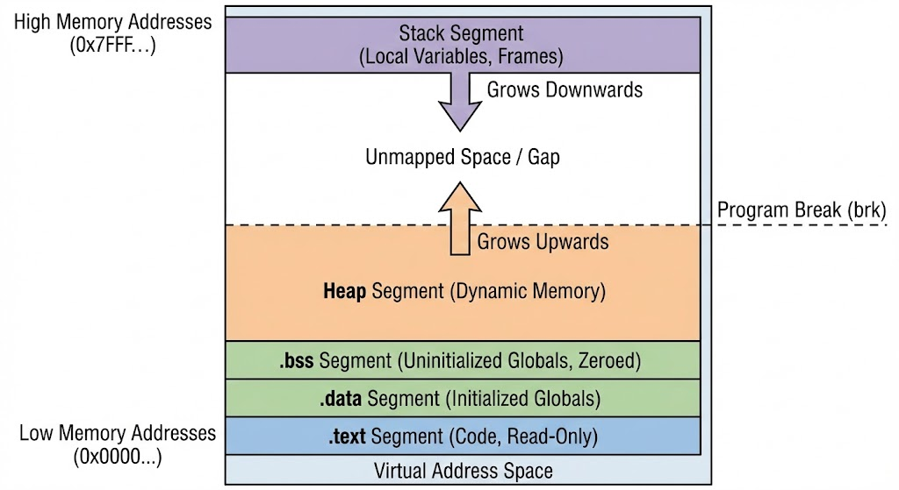
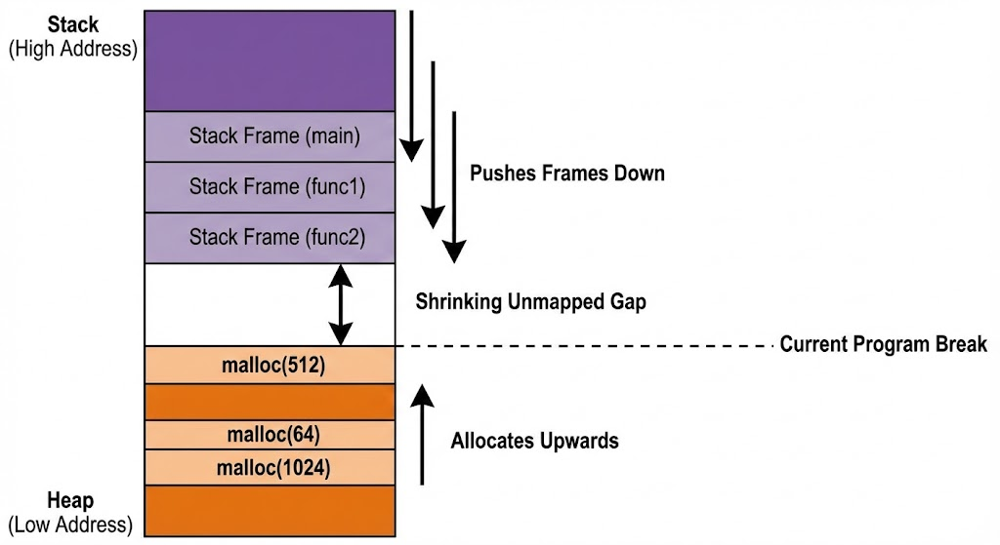

# **Topic 2: The Anatomy of a Program (Memory Segments)**

When you compile a C program, the resulting binary (ELF on Linux, PE on Windows) is not just a blob of random instructions. It is a highly organized structure divided into **Segments** (or Sections).

We will walk through them from **Low Memory Addresses** (bottom) to **High Memory Addresses** (top).

---

### **1. The Text Segment (`.text`)**

* **What is it?** This is your code. Every `if`, `for`, and function call is converted into machine code (binary instructions) and stored here.
* **Permissions:** **Read-Only** & **Execute**.
* **Deep Dive:**
* **Why Read-Only?** To prevent accidental modification (like your code overwriting itself with infinite recursion) and to allow **Shared Memory**.
* **Shared Memory:** If you run 50 copies of `chrome.exe`, the OS loads the `.text` segment **once** into physical RAM and maps it to all 50 processes. This saves gigabytes of RAM.

* **The Entry Point:** This segment contains the actual memory address where execution begins (usually `_start`, which calls `main`).

---

### **2. The Data Segment (`.data`)**

* **What is it?**  **Initialized** Global and Static variables.
* `int global_var = 10;`
* `static int local_static = 5;`

* **Permissions:** **Read/Write**.
* **Deep Dive:**
* These values are "baked" into your executable file.
* When the program starts, the OS copies these values from the hard drive directly into RAM.
* **Note on attached image:** You correctly identified that `local static` variables go here. Even though they are "local" in scope (only seen inside the function), they are "global" in lifetime (they survive forever).

---

### **3. The BSS Segment (`.bss`)**

* **Name Origin:** "Block Started by Symbol" (an ancient assembly command from the 1950s).
* **What is it?** **Uninitialized** Global and Static variables.
* `int global_var;` (Default is 0)
* `static int local_static;`

* **Permissions:** **Read/Write**.
* **The "0" Magic:**
* In your notes, you wrote they are set to **0**. This is guaranteed by the C Standard.
* **Optimization:** This segment takes up **Zero Space** in your hard drive file. The executable header just says: *"Please allocate 4096 bytes for BSS and wipe it with zeros."* The OS does this wiping at startup (using a specialized command like `memset` or mapping to a special "Zero Page").

---

### **4. The Heap**

* **What is it?** The "Wild West." Memory managed manually by **You** (`malloc`, `free`, `realloc`).
* **Direction:** Grows **Upward** (towards higher memory addresses).
* **Mechanism:**
* It is not a fixed block. When you call `malloc`, the allocator asks the kernel to move the "Program Break" (the boundary of your data segment) higher using the `brk()` or `sbrk()` system call.
* For huge allocations (e.g., 1GB), `malloc` bypasses the Heap and uses `mmap()` to ask the OS for a completely separate memory region.

* **Your Note:** You didn't explicitly mention Heap in the table, but it sits right above BSS.

---

### **5. The Stack**

* **What is it?** The scratchpad for Function Calls and Local Variables.
* **Direction:** Grows **Downward** (towards lower memory addresses) on x86 architectures.
* **Contents (The Stack Frame):**
* **Return Address:** Where to go back to when the function finishes.
* **Parameters:** Arguments passed to the function (if they don't fit in registers).
* **Local Variables:** `int x; char arr[10];` inside a function.
* **Saved Registers:** Backups of CPU state.

* **Deep Dive (The "LIFO" Structure):**
* **Push:** When `main` calls `func`, a new block (Frame) is pushed onto the stack. `RSP` (Stack Pointer) moves down.
* **Pop:** When `func` returns, `RSP` moves up. The memory is **not erased**; it is just marked as "free."
* **The Dirty Secret:** If you have a local variable `int password;` and don't initialize it, it will contain whatever random garbage value was left there by the *previous* function that used that stack space. This is a common security bug!

---

### **6. Unmapped Space (The Gap)**

Between the Heap (growing up) and the Stack (growing down), there is a giant gap of unmapped virtual memory.

* If the Heap meets the Stack (Memory Exhaustion), the OS kills the program.

---

### **Deep Analysis of Your Notes (Corrections & Expansions)**

Your notes are excellent, but here is the "Systems Level" nuance:

1. **"Static Local Variable" (Your Note #4 & #6):**
* *Your Note:* "Restores their values across function calls."
* *Deep Reality:* It doesn't "restore" anything. The variable **never leaves memory**. It sits in the `.data` or `.bss` segment permanently. The compiler just hides its *name* so other functions can't see it. It is effectively a Global Variable with a private name.

2. **"Local Variable" (Your Note #3 & #5):**
* *Your Note:* "Limited to that function... Garbage Value."
* *Deep Reality:* They live in the **Stack**. The "Garbage" is actually data from previous function calls (ghosts of the past).
* *Performance:* Creating a stack variable is **instant** (1 CPU cycle: just subtract 4 from the Stack Pointer). Creating a Heap variable (`malloc`) is **slow** (thousands of cycles).

3. **"Text Section" (Your Note bottom of pg 2):**
* *Your Note:* "Compiled machine code."
* *Deep Reality:* This section usually includes **Read-Only Data** (`.rodata`) too!
* Example: `char *s = "Hello";`
* The pointer `s` is on the **Stack**.
* The string literal `"Hello"` is in **.rodata** (part of Text).
* If you try `s[0] = 'h';`, you crash because you are writing to a Read-Only segment.

---

### **Visual Summary Table (For your Mental Model)**

| Variable Declaration | Scope (Visibility) | Lifetime | Segment | Initial Value |
| --- | --- | --- | --- | --- |
| `int global = 10;` | Whole Program | Forever | **DATA** | 10 |
| `int global;` | Whole Program | Forever | **BSS** | 0 |
| `static int s_glob = 10;` | File Only | Forever | **DATA** | 10 |
| `void func() { int loc; }` | Function Only | Temp | **STACK** | Garbage |
| `void func() { static int s = 5; }` | Function Only | Forever | **DATA** | 5 (set once) |
| `char *p = malloc(10);` | `p` is Func Only | Forever | **HEAP** | Garbage |
| `const int c = 100;` | Block/File | Forever | **RODATA** | 100 |

---

---
---
---
---
---

### **1. The Visual Memory Map**

This block diagram shows the five segments we discussed, arranged exactly as the OS manages them in Virtual Memory.

**Key Takeaway:** Notice the directions. The fixed segments sit at the bottom. The dynamic segments (Heap and Stack) grow towards each other into the empty space in the middle.

---

### **2. The Heap & The "Program Break"**

Let's break down the Heap in simple language.

#### **What is the Heap? (The Analogy)**

Imagine the **Stack** is like a neat stack of cafeteria trays. You put one on top, you take one off. It's fast, organized, but you can only access the top one.

The **Heap** is like a giant, messy whiteboard.

* You can write anywhere you find empty space.
* You can erase something in the middle.
* But to find space, you have to scan the board to see what's free.

In C, the Heap is a large pool of memory used for data whose size isn't known until runtime (like reading a file of unknown size). You manage it manually using `malloc()` (to reserve space) and `free()` (to release it).

#### **Visualization: The Dynamic "Squeeze"**

This image shows how the Stack and Heap interact during program execution.

* **Stack (Top):** As functions call other functions (`main` -> `func1` -> `func2`), new frames are pushed downward.
* **Heap (Bottom):** As you call `malloc`, new blocks are allocated upward.
* **The Risk:** If they meet, your program runs out of memory and crashes (Stack Overflow).

#### **What is the "Program Break"?**

Look at the dashed line in the images above. This is the core concept of Heap management.

* **Definition:** The "Program Break" is the boundary line that defines the *end* of the data segment (including the Heap) and the *beginning* of the unmapped gap.
* **Simple view:** It's the "fence" at the top of your current Heap property. Everything below the fence is yours. Everything above it is unowned wilderness.

#### **How `malloc` uses the Program Break**

When you call `void *p = malloc(1024);`, `malloc` doesn't just magically find memory. It acts as a manager:

1. **Check Internal List:** `malloc` first keeps a private list of "free blocks" that you previously released with `free()`. If it finds a 1024-byte hole in the *existing* Heap, it gives you that.
2. **Move the Fence:** If it has no free space, it must expand the Heap. It asks the Operating System: *"Please move the Program Break up by 1024 bytes."*
3. **System Call:** On Linux/Unix, it does this using the **`sbrk()`** (Set Break) system call.
4. **Result:** The OS moves the boundary line up into the Gap, turning unmapped virtual memory into valid Heap memory, which `malloc` then hands to you.

In short, the **Program Break** is the movable ceiling of the Heap.

---
