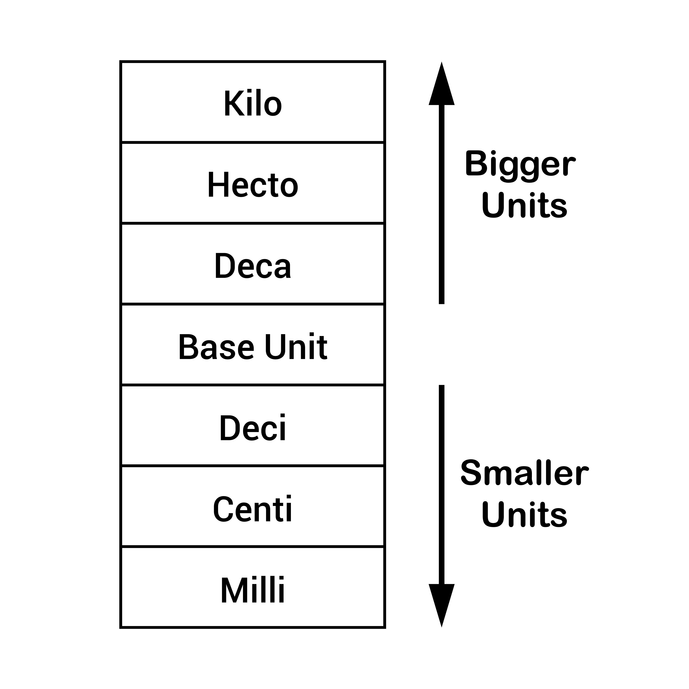

# **Topic 3: The Stack (The CPU's Workspace)**

The Stack is the most active area of memory. Every time you call a function, the CPU "builds" a workspace for it here. When the function returns, that workspace is destroyed (or rather, abandoned).

Understanding the Stack is the key to understanding **Recursion**, **Local Scope**, and the dreaded **Stack Overflow**.

---

### **1. The Mechanics: LIFO and Gravity**

Imagine the Stack as a physical stack of plates.

* **LIFO (Last In, First Out):** You can only add a plate to the top or remove the top plate.
* **Gravity (Memory Direction):** In x86 architecture, the "Ground" is High Memory (`0xFF...`). The Stack grows **Downwards** toward Low Memory (`0x00...`).

#### **The Hardware Engine: The Stack Pointer (`RSP`)**

The CPU has a specific register called **`RSP` (Stack Pointer)**.

* It holds the memory address of the **very top** (technically the bottom-most address) of the current stack.
* **"Pushing"** data (adding to stack):
1. Subtract size from `RSP` (e.g., `RSP = RSP - 4`).
2. Write data to that new address.


* **"Popping"** data (removing):
1. Read data from `RSP`.
2. Add size to `RSP` (e.g., `RSP = RSP + 4`).


* **Deep Insight:** Popping does **not erase** data. It just moves the pointer up. The old data (now "garbage") sits there until it gets overwritten by the next function call.

---

### **2. The Anatomy of a "Stack Frame"**

Every function call gets its own private block of memory on the Stack called a **Stack Frame** (or Activation Record).

Let's dissect exactly what is inside one Frame, from Top (High Address) to Bottom (Low Address).

#### **A. The Parameters (Optional)**

* If a function has many arguments (more than 6 on x64), they are pushed here *before* the function starts.

#### **B. The Return Address (Crucial)**

* **What is it?** The address of the instruction *immediately following* the function call in the caller code.
* **Purpose:** When the function finishes, the CPU pops this address into the Instruction Pointer (`RIP`) to resume execution where it left off.
* **Security Risk:** This is the target of **Buffer Overflow** attacks. If a hacker overwrites this address, they can redirect the CPU to execute their own malicious code.

#### **C. The Saved Base Pointer (`RBP`)**

* **What is it?** A backup of the *previous* function's "anchor" point. It allows the debugger (and the CPU) to walk back up the stack (Stack Trace).

#### **D. Local Variables**

* This is where `int x`, `char buf[100]` live.
* **Allocation:** The compiler calculates the total size needed (e.g., 104 bytes) and simply subtracts that amount from `RSP`. Instant allocation!

---

### **3. A Step-by-Step Execution Trace**

Let's watch the memory change as `main()` calls a function `add()`.

**C Code:**

```c
void add(int a, int b) {
    int sum = a + b;
    return;
}

int main() {
    int x = 10;
    add(x, 20);
    return 0;
}

```

#### **Phase 1: Inside `main()` (Before Call)**

* **Stack:** Contains `main`'s frame.
* **Variables:** `x` is stored at `RBP - 4`. Value `10`.

#### **Phase 2: The Call (The "Prologue")**

The CPU executes `add(x, 20)`.

1. **Argument Passing:** `x` (10) and `20` are put into registers (`EDI`, `ESI`).
2. **`CALL` Instruction:**
* Pushes the **Return Address** (the line after the call) onto the Stack.
* Jumps to `add`.


3. **Function Setup (Inside `add`):**
* **Push `RBP`:** Save `main`'s base pointer.
* **Move `RBP`, `RSP`:** Set the new "anchor" for `add`.
* **Subtract `RSP`, 4:** Make space for local variable `sum`.


**Visualizing the Stack now:**

```text
|-------------------| <High Address
| Main's Frame      |
| ... int x = 10    |
|-------------------|
| Return Address    | (Link back to main)
| Saved RBP         | (Link back to main's stack base)
| int sum           | (Current RSP points here)
|-------------------| <Low Address

```

#### **Phase 3: The Return (The "Epilogue")**

The function `add` finishes.

1. **Calculate:** `sum = 30`.
2. **`LEAVE` Instruction:**
* Moves `RSP` back to `RBP` (effectively discarding/freeing `sum` instantly).
* Pops the "Saved RBP" back into the `RBP` register (restoring `main`'s anchor).


3. **`RET` Instruction:**
* Pops the "Return Address" into the Instruction Pointer.
* The CPU jumps back to `main`.


---

### **4. Deep Dive: Stack Overflow**

Now you can understand exactly why a crash happens.

**Recursive Code:**

```c
void crash() {
    int arr[1000]; // 4000 bytes
    crash();       // Recursive call
}

```

1. **Call 1:** Stack grows down by ~4KB.
2. **Call 2:** Stack grows down by another ~4KB.
3. **Call 1000:** Stack has grown by 4MB.
4. **Limit:** The OS usually sets a Stack Limit of **8MB** (on Linux, check with `ulimit -s`).
5. **The Crash:** Eventually, `RSP` tries to move into a memory address that is **Unmapped** (The "Gap" we saw in Topic 2).
6. **Hardware Trap:** The MMU sees an invalid write. **Segmentation Fault.**

---

### **5. Summary Checklist**

* [ ] **Fast:** Allocation is just subtraction. Deallocation is addition.
* [ ] **Automatic:** You don't manage it. The compiler generates the Push/Pop code.
* [ ] **Fixed Size:** Variables must have a known size at compile time (except for VLA).
* [ ] **Dirty:** "Freeing" memory doesn't wipe it. It just moves the pointer.

---
